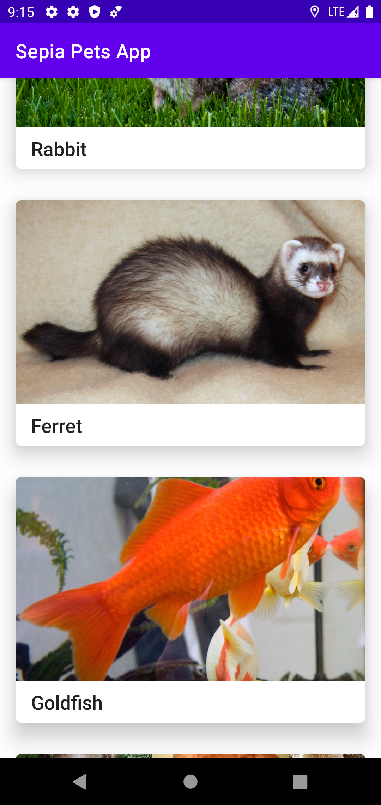
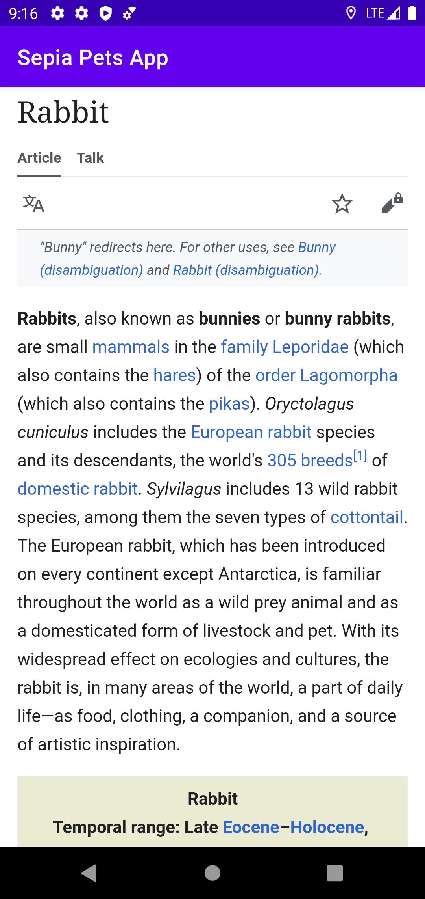
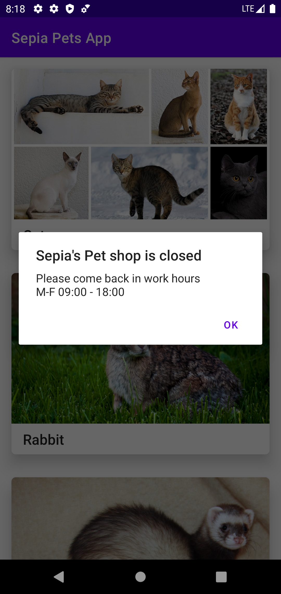

# Android MVVM Architecture: Sepia Pet's app

This repository contains a detailed sample app that implements MVVM architecture.

  
   
  

#### The app has following packages:
1. **ui**: View classes along with their corresponding ViewModel.
2. **repository**: It contains logic to fetch data currently its fetching from local json, but it can be scale easily but adding api logic other app component will work smoothly.
3. **model**: It contains data classes.
4. **utils**: Utility classes.

